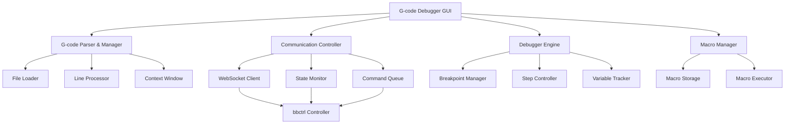

# G-Code Debugger Application - Detailed Plan

Based on my analysis of the existing bbctrl-firmware codebase, I'll create a comprehensive G-code debugger that extends the successful `send_gcode_direct.py` approach into a full-featured GUI application.

## 🎯 Project Overview

**Application Name**: `bbctrl-gcode-debugger`  
**Type**: Standalone Python GUI application with tkinter  
**Communication**: WebSocket-based (leveraging the proven `send_gcode_direct.py` approach)  
**Location**: `Tools/gcode_debugger/`

## 🏗️ Architecture Design



## 📋 Core Features & Components

### 1. **Main GUI Interface**
- **Code Editor Pane**: Syntax-highlighted G-code display with line numbers
- **Control Panel**: Debug controls (Play, Pause, Step, Stop, etc.)
- **Status Panel**: Machine state, current position, feed rate
- **Context Window**: Shows 10-15 lines around current execution point
- **Variable Watch**: Monitor coordinate systems, tool offsets, etc.
- **Console Output**: Command history and responses

### 2. **Debug Controls**
- ▶️ **Continue**: Resume execution from current line
- ⏸️ **Pause**: Pause execution (user pause)
- ⏭️ **Step Over**: Execute current line and move to next
- ⏩ **Step To Line**: Execute until specified line number
- ⏪ **Go Back**: Return to previous line (with state restoration)
- 🔄 **Skip Line**: Skip current line without execution
- 🎯 **Skip To Line**: Jump to specified line without execution
- 🛑 **Stop**: Stop execution completely
- 🚨 **Emergency Stop**: Send immediate E-stop (ESC key)

### 3. **G-code Management**
- **File Loading**: Support .nc, .gcode, .tap files
- **Line Filtering**: Automatically skip comments (`;`) and blank lines
- **Line Editing**: Modify G-code lines during debugging
- **Breakpoints**: Set/remove breakpoints on specific lines
- **Search/Find**: Find specific G-codes or patterns

### 4. **Communication Layer**
- **WebSocket Connection**: Based on proven `send_gcode_direct.py`
- **State Monitoring**: Real-time machine state updates
- **Command Queue**: Manage command sending and responses
- **Error Handling**: Robust error detection and recovery

### 5. **Macro System**
- **Macro Creation**: Record sequences of G-code commands
- **Macro Storage**: Save/load macros to/from files
- **Macro Execution**: Run macros during debugging sessions
- **Quick Macros**: Predefined common operations (home, zero, etc.)

## 🗂️ File Structure

```
Tools/gcode_debugger/
├── main.py                 # Main application entry point
├── gui/
│   ├── __init__.py
│   ├── main_window.py      # Main GUI window
│   ├── code_editor.py      # G-code editor widget
│   ├── control_panel.py    # Debug controls
│   ├── status_panel.py     # Machine status display
│   ├── macro_panel.py      # Macro management
│   └── dialogs.py          # Various dialog boxes
├── core/
│   ├── __init__.py
│   ├── gcode_parser.py     # G-code file parsing
│   ├── debugger.py         # Debug engine
│   ├── communication.py    # WebSocket communication
│   ├── state_manager.py    # Machine state tracking
│   └── macro_manager.py    # Macro system
├── utils/
│   ├── __init__.py
│   ├── config.py           # Configuration management
│   ├── logger.py           # Logging utilities
│   └── helpers.py          # Utility functions
├── resources/
│   ├── icons/              # GUI icons
│   └── themes/             # Color themes
├── macros/                 # Default macro files
│   ├── homing.gcode
│   ├── zero_all.gcode
│   └── tool_change.gcode
├── requirements.txt        # Python dependencies
└── README.md              # Documentation
```

## 🎨 GUI Layout Design

```
┌─────────────────────────────────────────────────────────────────┐
│ File  Edit  Debug  Macros  Help                    [●○○] bbctrl │
├─────────────────────────────────────────────────────────────────┤
│ 📁 Load File    ▶️ Continue  ⏸️ Pause  ⏭️ Step  🛑 Stop  🚨 E-Stop │
├─────────────────┬───────────────────────────────────────────────┤
│ G-Code Editor   │ Status Panel                                  │
│ ┌─────────────┐ │ State: READY     Position: X0 Y0 Z0          │
│ │  1  G90     │ │ Feed: 1000       Spindle: OFF                │
│ │  2  G0 X10  │ │ Tool: T1         Coolant: OFF                │
│ │► 3  G1 Y20  │ │                                              │
│ │  4  M3 S100 │ │ Context Window (±7 lines)                   │
│ │  5  G1 Z-5  │ │ ┌─────────────────────────────────────────┐ │
│ │  6  G1 X20  │ │ │  1  G90                                 │ │
│ │  7  G0 Z5   │ │ │  2  G0 X10                              │ │
│ │  8  M5      │ │ │► 3  G1 Y20  F1000                       │ │
│ │  9  M30     │ │ │  4  M3 S1000                            │ │
│ └─────────────┘ │ │  5  G1 Z-5                              │ │
│                 │ └─────────────────────────────────────────┘ │
├─────────────────┼───────────────────────────────────────────────┤
│ Macros          │ Console Output                                │
│ [Home All]      │ > G90                                         │
│ [Zero All]      │ < ok                                          │
│ [Tool Change]   │ > G0 X10                                      │
│ [Custom...]     │ < ok                                          │
│                 │ > G1 Y20 F1000                                │
└─────────────────┴───────────────────────────────────────────────┘
```

## 🔧 Technical Implementation Details

### 1. **Communication Protocol**
```python
# Based on send_gcode_direct.py success
class BBCtrlCommunicator:
    def __init__(self, host='bbctrl.local'):
        self.ws_url = f'ws://{host}/websocket'
        self.rest_url = f'http://{host}/api'
    
    def send_command(self, gcode):
        # Send via WebSocket like send_gcode_direct.py
        
    def get_state(self):
        # Get machine state via REST API
        
    def emergency_stop(self):
        # Send immediate E-stop command
```

### 2. **Debug Engine**
```python
class GCodeDebugger:
    def __init__(self):
        self.current_line = 0
        self.breakpoints = set()
        self.execution_stack = []  # For go-back functionality
        
    def step_over(self):
        # Execute current line and advance
        
    def step_to_line(self, target_line):
        # Execute until target line
        
    def go_back(self):
        # Restore previous state and position
```

### 3. **G-code Parser**
```python
class GCodeParser:
    def parse_file(self, filepath):
        # Parse G-code file, filter comments/blanks
        # Return structured line data
        
    def get_context_window(self, current_line, window_size=7):
        # Return lines around current position
```

### 4. **Emergency Stop Handling**
```python
def setup_emergency_stop():
    # Bind ESC key globally
    root.bind('<Escape>', lambda e: emergency_stop())
    
def emergency_stop():
    # Send immediate E-stop command
    communicator.send_command('!')  # or appropriate E-stop code
```

## 🎯 Advanced Features

### 1. **Breakpoint System**
- **Line Breakpoints**: Stop at specific line numbers
- **Conditional Breakpoints**: Stop when conditions are met (e.g., X > 100)
- **Temporary Breakpoints**: One-time breakpoints that auto-remove

### 2. **State Restoration (Go Back)**
- **Position Stack**: Track machine positions at each step
- **State Snapshots**: Save coordinate systems, tool offsets
- **Smart Restoration**: Generate G-code to restore previous state

### 3. **Variable Watching**
- **Coordinate Systems**: G54, G55, etc.
- **Tool Offsets**: Current tool length/diameter
- **Modal States**: G90/G91, G20/G21, etc.
- **Custom Variables**: User-defined watch expressions

### 4. **Macro System**
```python
class MacroManager:
    def create_macro(self, name, commands):
        # Create new macro from command sequence
        
    def execute_macro(self, name):
        # Execute macro during debugging
        
    def record_macro(self):
        # Record user actions as macro
```

### 5. **Enhanced Error Handling**
- **Syntax Checking**: Pre-validate G-code before sending
- **Error Recovery**: Suggest corrections for common errors
- **Safe Mode**: Confirm potentially dangerous commands

## 📦 Dependencies

```txt
# requirements.txt
tkinter>=8.6          # GUI framework (usually built-in)
websocket-client>=1.0 # WebSocket communication
requests>=2.25        # HTTP requests
pygments>=2.10        # Syntax highlighting
configparser>=5.0     # Configuration management
```

## 🚀 Implementation Phases

### Phase 1: Core Infrastructure (Week 1)
- [ ] Basic GUI layout with tkinter
- [ ] WebSocket communication (based on send_gcode_direct.py)
- [ ] G-code file loading and parsing
- [ ] Basic step-through functionality

### Phase 2: Debug Controls (Week 2)
- [ ] All debug controls (step, continue, pause, stop)
- [ ] Breakpoint system
- [ ] Context window display
- [ ] Emergency stop (ESC key)

### Phase 3: Advanced Features (Week 3)
- [ ] Line editing capability
- [ ] Go-back functionality with state restoration
- [ ] Variable watching
- [ ] Enhanced error handling

### Phase 4: Macro System (Week 4)
- [ ] Macro creation and storage
- [ ] Macro execution during debugging
- [ ] Predefined macro library
- [ ] Macro recording functionality

### Phase 5: Polish & Testing (Week 5)
- [ ] UI/UX improvements
- [ ] Comprehensive testing
- [ ] Documentation
- [ ] Performance optimization

## 🎨 User Experience Features

### 1. **Keyboard Shortcuts**
- `F5`: Continue
- `F10`: Step Over
- `F11`: Step Into (for subroutines)
- `Shift+F11`: Step Out
- `Ctrl+F10`: Run to Cursor
- `ESC`: Emergency Stop
- `F9`: Toggle Breakpoint

### 2. **Visual Indicators**
- **Current Line**: Highlighted with arrow (►)
- **Breakpoints**: Red dots in gutter
- **Executed Lines**: Grayed out or different color
- **Error Lines**: Red highlighting
- **Modified Lines**: Yellow highlighting

### 3. **Context Menus**
- Right-click on line numbers for breakpoint options
- Right-click on G-code for edit/copy/macro options
- Right-click on variables for watch options

## 🔒 Safety Features

### 1. **Confirmation Dialogs**
- Confirm potentially dangerous moves (rapid to negative Z)
- Confirm spindle/coolant commands
- Confirm large coordinate changes

### 2. **Limits Checking**
- Warn about moves outside machine limits
- Check for reasonable feed rates
- Validate tool numbers

### 3. **Emergency Procedures**
- ESC key always available for E-stop
- Clear visual indication of E-stop state
- Easy recovery from E-stop condition

This comprehensive plan leverages the existing successful communication patterns while adding sophisticated debugging capabilities that will make G-code development and testing much more efficient and safe.