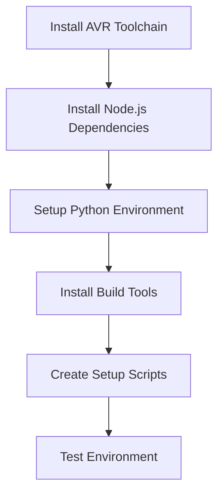

# Native macOS Build Plan for Buildbotics CNC Controller Firmware

## Project Analysis

The Buildbotics CNC Controller firmware is a complex multi-component project currently built using Docker. The system includes:

- **AVR Firmware**: ATxmega256a3 (main controller) and ATtiny3216 (power management)
- **Python Backend**: Tornado web framework with system integration
- **JavaScript Frontend**: Pug templating, Stylus CSS, and modern JS tooling
- **Cross-compilation**: ARM target for Raspberry Pi deployment

## Implementation Plan

### Phase 1: Development Environment Setup



**Step 1: AVR Toolchain Installation**
```bash
# Install AVR toolchain via Homebrew
brew tap osx-cross/avr
brew install avr-gcc avrdude
# Verify ATxmega256a3 and ATtiny3216 support
avr-gcc --target-help | grep -i xmega
```

**Step 2: Node.js Environment Setup**
```bash
# Install Node.js and dependencies
brew install node
cd Work/Buildbotics/bbctrl-firmware
npm install
# Verify build tools
./node_modules/.bin/pug --version
./node_modules/.bin/stylus --version
```

**Step 3: Python Development Environment**
```bash
# Create virtual environment
python3 -m venv venv
source venv/bin/activate
# Install base dependencies
pip install tornado pyserial sockjs-tornado
# Handle macOS-specific replacements for pyudev and smbus2
```

### Phase 2: Build System Adaptation

**Step 4: Makefile Modifications**
- Update `src/avr/Makefile.common` for macOS paths
- Modify compiler flags and tool invocations
- Handle dependency tracking differences

**Step 5: Cross-compilation Setup**
- Configure ARM toolchain for Raspberry Pi target
- Setup CAMotics module build environment
- Create packaging scripts for deployment

### Phase 3: Automation and Testing

**Step 6: Create Setup Scripts**
- `setup-macos.sh`: Automated environment setup
- `build-test.sh`: Build validation and testing
- `deploy.sh`: Controller deployment scripts

**Step 7: Build Validation**
- Test AVR firmware compilation for both targets
- Validate frontend asset generation
- Test Python backend functionality
- Verify end-to-end packaging

**Step 8: Documentation and Deployment**
- Create comprehensive macOS build documentation
- Test on clean macOS system
- Validate deployment to Buildbotics controller

## Technical Challenges & Solutions

### 1. AVR Toolchain Compatibility
**Challenge**: ATxmega256a3 support in modern toolchains
**Solution**: Use specific avr-gcc version or CrossPack-AVR alternative

### 2. Python Dependencies
**Challenge**: Linux-specific `pyudev` and `smbus2` packages
**Solution**: Create macOS-compatible wrappers using native APIs

### 3. Cross-compilation Complexity
**Challenge**: ARM cross-compilation for CAMotics module
**Solution**: Use Docker container for ARM builds or native ARM toolchain

### 4. Build System Integration
**Challenge**: Linux-specific paths and commands in Makefiles
**Solution**: Platform detection and conditional compilation

## Implementation Timeline

**Week 1: Environment Setup**
- Days 1-2: AVR toolchain installation and testing
- Days 3-4: Node.js and Python environment setup
- Day 5: Initial build testing

**Week 2: Build System Adaptation**
- Days 1-3: Makefile modifications for macOS
- Days 4-5: Python dependency replacements

**Week 3: Integration and Testing**
- Days 1-2: Create automation scripts
- Days 3-4: End-to-end build testing
- Day 5: Documentation and validation

## Success Criteria

- [ ] AVR firmware compiles for ATxmega256a3 and ATtiny3216
- [ ] Frontend assets build correctly (HTML, CSS, JS)
- [ ] Python backend runs on macOS
- [ ] Package creation works end-to-end
- [ ] Can deploy to Buildbotics controller
- [ ] Automated setup script works on clean macOS
- [ ] Build time comparable to Docker approach
- [ ] All tests pass

## Detailed Implementation Steps

### Step 1: AVR Toolchain Installation

```bash
#!/bin/bash
# setup-avr-toolchain.sh

echo "Installing AVR toolchain for macOS..."

# Method 1: Use Homebrew (recommended)
brew tap osx-cross/avr
brew install avr-gcc avrdude

# Method 2: Alternative - CrossPack-AVR
# Download from https://www.obdev.at/products/crosspack/index.html

# Verify installation
echo "Verifying AVR toolchain installation..."
avr-gcc --version
avrdude -v

# Check MCU support
echo "Checking microcontroller support..."
avr-gcc --target-help | grep -i xmega
avr-gcc --target-help | grep -i attiny

# Test basic compilation
echo "Testing basic AVR compilation..."
cat > test_avr.c << 'EOF'
#include <avr/io.h>
int main() {
    return 0;
}
EOF

avr-gcc -mmcu=atxmega256a3 test_avr.c -o test_avr.elf
if [ $? -eq 0 ]; then
    echo "✓ ATxmega256a3 compilation test passed"
else
    echo "✗ ATxmega256a3 compilation test failed"
fi

avr-gcc -mmcu=attiny3216 test_avr.c -o test_avr.elf
if [ $? -eq 0 ]; then
    echo "✓ ATtiny3216 compilation test passed"
else
    echo "✗ ATtiny3216 compilation test failed"
fi

rm -f test_avr.c test_avr.elf
```

### Step 2: Node.js Environment Setup

```bash
#!/bin/bash
# setup-nodejs.sh

echo "Setting up Node.js environment..."

# Install Node.js via Homebrew
brew install node

# Verify installation
node --version
npm --version

# Install project dependencies
echo "Installing project dependencies..."
npm install

# Verify build tools
echo "Verifying build tools..."
./node_modules/.bin/pug --version
./node_modules/.bin/stylus --version
./node_modules/.bin/jshint --version

# Test frontend build
echo "Testing frontend build..."
make html
if [ $? -eq 0 ]; then
    echo "✓ Frontend build test passed"
else
    echo "✗ Frontend build test failed"
fi
```

### Step 3: Python Environment Setup

```bash
#!/bin/bash
# setup-python.sh

echo "Setting up Python environment..."

# Create virtual environment
python3 -m venv venv
source venv/bin/activate

# Install base dependencies
pip install --upgrade pip
pip install tornado pyserial sockjs-tornado

# Handle macOS-specific dependencies
echo "Installing macOS-compatible dependencies..."

# Replace pyudev with macOS alternatives
pip install pyobjc-framework-IOKit  # For USB device monitoring

# Replace smbus2 with pyserial for I2C (if needed)
# pip install pyserial

# Install development tools
pip install pylint setuptools

# Test Python backend
echo "Testing Python backend..."
python3 -c "import tornado; import pyserial; print('✓ Python dependencies OK')"
```

### Step 4: Makefile Modifications

Create `src/avr/Makefile.macos` with macOS-specific configurations:

```makefile
# Makefile.macos - macOS-specific build configuration

# macOS-specific paths
ifeq ($(shell uname -s),Darwin)
    # Use Homebrew paths
    AVR_PREFIX := /usr/local/bin/avr-
    AVRDUDE_PREFIX := /usr/local/bin/
    
    # macOS-specific compiler flags
    CFLAGS += -I/usr/local/include
    LDFLAGS += -L/usr/local/lib
    
    # Handle macOS-specific tools
    SED := gsed
    FIND := gfind
else
    # Linux defaults
    AVR_PREFIX := avr-
    AVRDUDE_PREFIX := 
    SED := sed
    FIND := find
endif

# Override tool definitions
CC := $(AVR_PREFIX)g++
OBJCOPY := $(AVR_PREFIX)objcopy
OBJDUMP := $(AVR_PREFIX)objdump
SIZE := $(AVR_PREFIX)size
NM := $(AVR_PREFIX)nm
AVRDUDE := $(AVRDUDE_PREFIX)avrdude
```

### Step 5: Python Dependency Replacements

Create `src/py/bbctrl/macos_compat.py`:

```python
"""
macOS compatibility layer for Linux-specific dependencies
"""

import sys
import platform

def get_usb_devices():
    """macOS replacement for pyudev USB device enumeration"""
    if platform.system() == 'Darwin':
        # Use macOS-specific USB device enumeration
        try:
            import subprocess
            result = subprocess.run(['system_profiler', 'SPUSBDataType'], 
                                  capture_output=True, text=True)
            return parse_usb_devices(result.stdout)
        except Exception as e:
            print(f"Warning: USB device enumeration failed: {e}")
            return []
    else:
        # Use pyudev on Linux
        import pyudev
        context = pyudev.Context()
        return list(context.list_devices(subsystem='usb'))

def parse_usb_devices(output):
    """Parse system_profiler output for USB devices"""
    devices = []
    # Implementation depends on specific USB device requirements
    return devices

# Additional macOS compatibility functions as needed
```

### Step 6: Complete Setup Script

Create `setup-macos.sh`:

```bash
#!/bin/bash
# setup-macos.sh - Complete macOS build environment setup

set -e

echo "Buildbotics CNC Controller - macOS Build Setup"
echo "=============================================="

# Check macOS version
echo "Checking macOS version..."
sw_vers

# Check for Homebrew
if ! command -v brew &> /dev/null; then
    echo "Homebrew not found. Please install Homebrew first:"
    echo '/bin/bash -c "$(curl -fsSL https://raw.githubusercontent.com/Homebrew/install/HEAD/install.sh)"'
    exit 1
fi

# Update Homebrew
echo "Updating Homebrew..."
brew update

# Install AVR toolchain
echo "Installing AVR toolchain..."
brew tap osx-cross/avr
brew install avr-gcc avrdude

# Install Node.js
echo "Installing Node.js..."
brew install node

# Install Python dependencies
echo "Setting up Python environment..."
python3 -m venv venv
source venv/bin/activate
pip install --upgrade pip
pip install tornado pyserial sockjs-tornado pylint setuptools

# Install GNU tools (if needed)
echo "Installing GNU tools..."
brew install gnu-sed findutils

# Install project dependencies
echo "Installing project dependencies..."
npm install

# Create build directories
echo "Creating build directories..."
mkdir -p build/{avr,pwr,http}

# Test installations
echo "Testing installations..."
./test-build-env.sh

echo "Setup complete! You can now run 'make' to build the firmware."
```

### Step 7: Build Test Script

Create `build-test.sh`:

```bash
#!/bin/bash
# build-test.sh - Comprehensive build testing

set -e

echo "Buildbotics Firmware - Build Test"
echo "================================="

# Activate Python environment
source venv/bin/activate

# Test AVR firmware build
echo "Testing AVR firmware build..."
make -C src/avr clean
make -C src/avr
echo "✓ AVR firmware build successful"

# Test power management firmware build
echo "Testing power management firmware build..."
make -C src/pwr clean
make -C src/pwr
echo "✓ Power management firmware build successful"

# Test frontend build
echo "Testing frontend build..."
make clean
make html
echo "✓ Frontend build successful"

# Test Python backend
echo "Testing Python backend..."
python3 -m py_compile src/py/bbctrl/*.py
echo "✓ Python backend compilation successful"

# Test packaging
echo "Testing packaging..."
make pkg
echo "✓ Packaging successful"

echo "All build tests passed!"
```

## Next Steps

1. **Create setup-macos.sh script** - Run the complete setup process
2. **Test AVR toolchain** - Verify microcontroller support
3. **Adapt Makefiles** - Add macOS-specific configurations
4. **Test build process** - Run comprehensive build tests
5. **Document any issues** - Create troubleshooting guide

This plan provides a complete roadmap for transitioning from Docker-based builds to native macOS builds while maintaining full functionality and deployment capability to Buildbotics controllers.